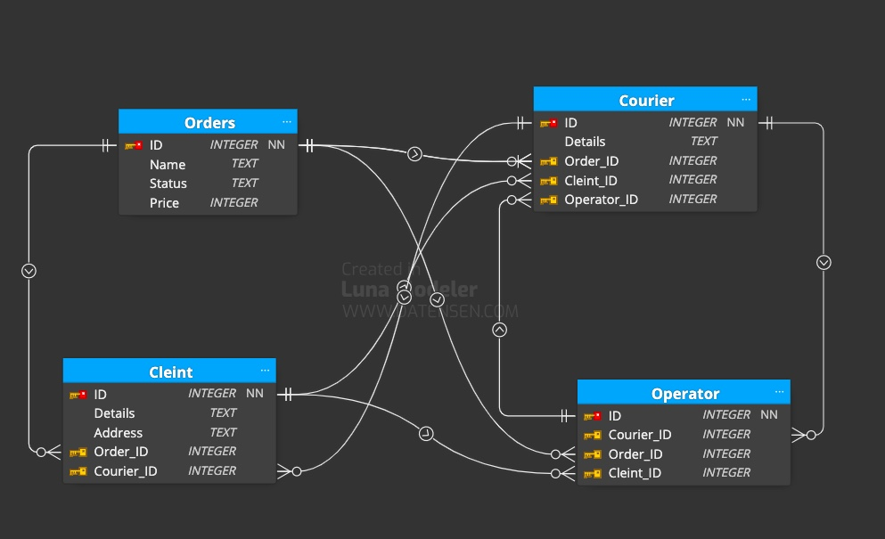
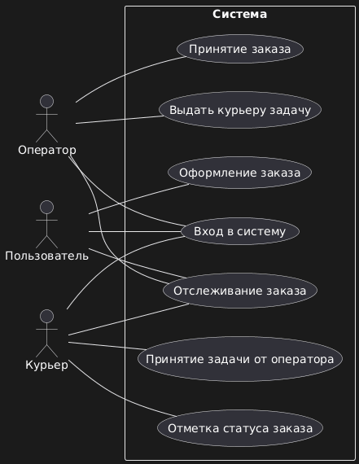

# Предметная область
## В предметной области «Учёт доставки заказов» база данных будет описывать процесс оформления, перемещения и доставки заказов. Для этого в системе будут учитываться и отслеживаться следующие сущности и данные:
| Заказы | Клиент | Курьер | Оператор |
| --- | --- | --- | --- |
| Номер заказа | Идентификатор клиента | Идентификатор курьера | |
| Статус | Контактные данные (телефон, email) | Контактные данные |  |
| Стоимость | Адрес доставки | |
## Основные функции:
### 1. Управление заказами
#### Приём и регистрация заказов (ввод данных клиента, товаров, адреса доставки).
### 2. Управление клиентами
#### Ведение базы клиентов (ФИО, контакты, адреса).
#### Возможность отслеживания заказов клиентом.
#### Уведомления клиента о статусе доставки.
### 3. Управление товарами
#### Контроль оператором отправки товара и назначения курьера
## Архитектура: многоуровневая
## Таблицы: таблица заказов (клиент, заказ, дата, статус)
## Реализация: консольное приложение, написанное на языке Python и использующее SQLite
# Визуализация таблиц базы данных:

# Действия, выполняемые актёрами:
